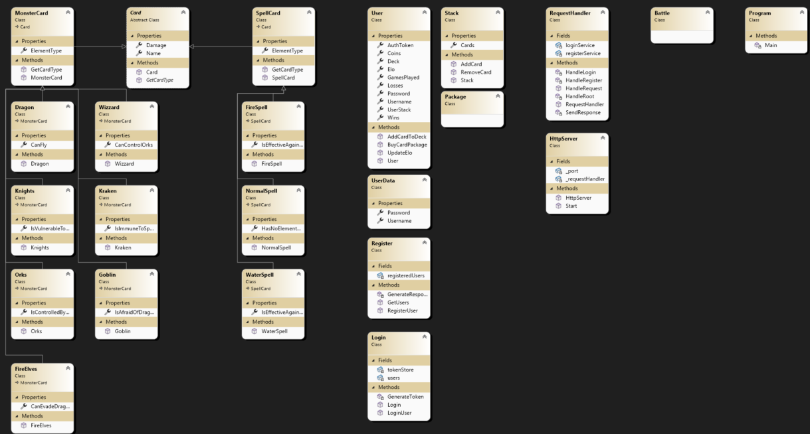

# Monster Trading Cards Game (MTCG)

## Überblick

Dieses Projekt implementiert das **Monster Trading Cards Game (MTCG)** als REST-basierenden HTTP-Server in C#. Der Server ermöglicht es Benutzern, sich zu registrieren und anzumelden.

## Features

- **Benutzerverwaltung**: Benutzer können sich registrieren und anmelden. Jeder Benutzer besitzt einen Benutzernamen, ein Passwort und einen Authentifizierungstoken.
- **Kartenverwaltung**: Ein Benutzer kann Kartenpakete kaufen und sein Kartendeck verwalten. Jede Karte hat einen Namen, eine Schadenszahl und einen Elementtyp (Feuer, Wasser, Normal).
- **Kartentypen**: Es gibt zwei Arten von Karten: Monsterkarten und Zauberkarten. Der Schaden einer Karte ist fest und wird durch den Elementtyp beeinflusst.

## Projektstruktur

Das Projekt besteht aus den folgenden Hauptkomponenten:

1. **Server (HttpServer)**: Implementiert einen einfachen HTTP-Server, der HTTP-Anfragen entgegennimmt und verarbeitet.
2. **RequestHandler**: Verantwortlich für die Handhabung von Anfragen (z.B. Benutzerregistrierung, Login).
3. **Benutzerverwaltung (Register, Login)**: Verwaltung der registrierten Benutzer und Authentifizierung durch Login und Token-Generierung.
4. **Modelle (User, Card, MonsterCard, SpellCard, Stack)**: Definiert die Datenstrukturen für Benutzer und Karten sowie die Logik zur Verwaltung von Decks und Kämpfen.

## Klassendiagramm

## Installation

1. Klone das Repository und öffne das Projekt in Visual Studio.
2. Stelle sicher, dass alle Abhängigkeiten korrekt installiert sind (z.B. Newtonsoft.Json für die JSON-Verarbeitung).
3. Starte den Server durch Ausführen der `Program.cs`-Datei.
4. Der Server wird auf `http://localhost:10001` laufen.

## API Endpunkte

Die API unterstützt folgende Endpunkte:

- `POST /users`: Registrierung eines neuen Benutzers.
- `POST /sessions`: Benutzer-Login und Token-Generierung.
